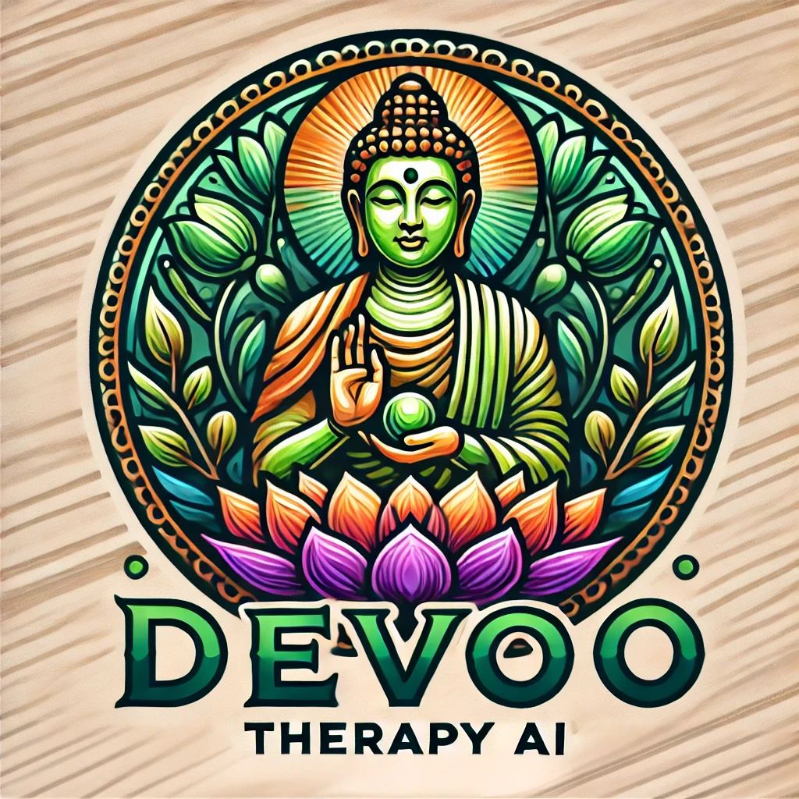

Welcome to the AI Therapy App project! This app aims to revolutionize mental health care by offering users personalized therapy sessions through AI-driven interactions. Our mission is to make mental health support accessible, affordable, and effective for everyone.

Features
Personalized Therapy Sessions: Tailored to individual needs.
AI-Powered Chatbot: Provides support and guidance.
Progress Tracking: Monitor your mental health journey.
Secure and Confidential: Your data is protected.

Technologies Used
Frontend: React.js
Backend: Django REST Framework
AI Model: OpenAI GPT
Database: PostgreSQL

work cited 
chat gpt by open ai

